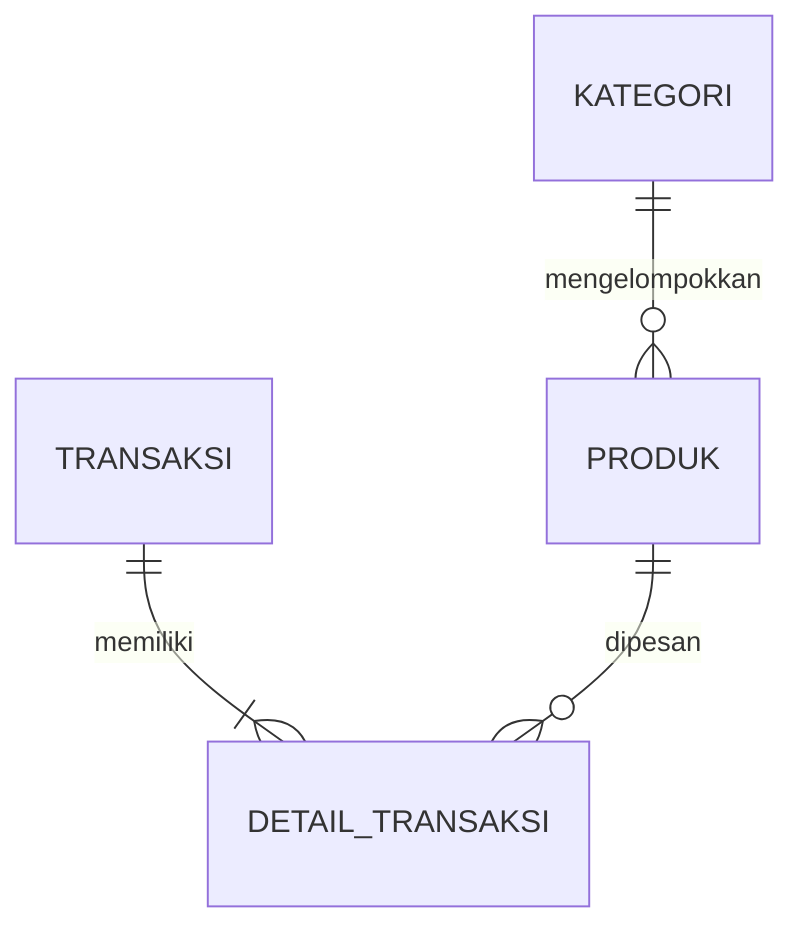

# Food Order STS RPL

Aplikasi web untuk mengelola produk, stok, dan transaksi pemesanan makanan. 

## Identitas

| Informasi | Keterangan |
| --- | --- |
| Nama | Cherryl Callista Cheniago |
| Kelas | 12 RPL |
| Nomor Absen | 2 |
| Tema | Food Order |
| GitHub | [cherrylcallista/sts-rpl](https://github.com/cherrylcallista/sts-rpl) |

## Tujuan

Membantu kasir atau operator mencatat penjualan, mengelola produk dan stok, serta memantau aktivitas transaksi melalui dashboard.

## Fitur

- **Manajemen produk:** tambah, lihat, edit, dan hapus produk.
- **Pencarian dan filter produk:** cari berdasarkan nama atau kode produk dan filter berdasarkan kategori.
- **Transaksi:** pilih beberapa produk, ubah jumlah pesanan, hitung total otomatis, dan simpan transaksi.
- **Manajemen transaksi:** lihat daftar dan detail, cari berdasarkan kode transaksi atau nama pelanggan, edit item transaksi, dan hapus riwayat transaksi.
- **Stok otomatis:** stok produk berkurang setelah transaksi berhasil; perubahan atau penghapusan transaksi selesai menyesuaikan stok kembali.
- **Validasi:** validasi pada form dan backend untuk field wajib, nilai angka, jumlah item, dan ketersediaan stok.
- **Notifikasi:** toast memberi informasi keberhasilan atau kegagalan aksi.
- **Dashboard:** menampilkan pendapatan, jumlah transaksi, jumlah produk, stok menipis, dan lima transaksi terbaru.
- **UI responsif:** navigasi dan halaman menyesuaikan ukuran layar.

## Teknologi

| Bagian | Teknologi |
| --- | --- |
| Frontend | Next.js 16, React 19, TypeScript |
| Styling | Tailwind CSS 4 |
| Ikon | Lucide React |
| Backend | Node.js, Express 5 |
| Database | MySQL melalui `mysql2` |
| Konfigurasi lingkungan | `dotenv` |

## Struktur Proyek

```text
.
├── backend/
│   ├── config/database.js       # Koneksi MySQL
│   ├── routes/
│   │   ├── products.js          # Endpoint kategori dan produk
│   │   └── transactions.js      # Endpoint ringkasan dan transaksi
│   ├── utils/
│   │   ├── errors.js            # Helper error
│   │   └── validation.js        # Validasi input produk dan transaksi
│   └── server.js                # Bootstrap Express
├── frontend/
│   ├── app/
│   │   ├── page.tsx             # Dashboard
│   │   ├── produk/              # Manajemen produk
│   │   └── transaksi/
│   │       ├── page.tsx         # Riwayat dan manajemen transaksi
│   │       └── baru/page.tsx    # Checkout transaksi
│   ├── components/              # Komponen dashboard, produk, transaksi, dan umum
│   └── types/                   # Tipe data TypeScript
├── package.json                
└── README.md
```

## Struktur Database

Database bernama `sts_rpl` dan menggunakan empat tabel utama.

| Tabel | Kolom utama | Keterangan |
| --- | --- | --- |
| `kategori` | `id_kategori` (PK), `nama_kategori`, `keterangan` | Kelompok produk, misalnya Makanan, Minuman, dan Snack. |
| `produk` | `id_produk` (PK), `id_kategori` (FK), `kode_produk`, `nama_produk`, `harga`, `stok`, `deskripsi`, `created_at` | Menyimpan data produk dan stok. |
| `transaksi` | `id_transaksi` (PK), `kode_transaksi`, `tanggal_transaksi`, `nama_pelanggan`, `total_bayar`, `status` | Menyimpan informasi utama transaksi. |
| `detail_transaksi` | `id_detail` (PK), `id_transaksi` (FK), `id_produk` (FK), `jumlah`, `subtotal` | Menyimpan produk dan kuantitas pada setiap transaksi. |

Relasi antartabel:



`kategori` ke `produk` adalah relasi satu-ke-banyak. Relasi transaksi dan produk menjadi banyak-ke-banyak melalui `detail_transaksi`, sehingga satu transaksi dapat berisi beberapa produk dan satu produk dapat muncul di banyak transaksi.

### Membuat Tabel

Jika database belum memiliki tabel, jalankan SQL berikut pada MySQL. Sesuaikan bila tabel sudah dibuat sebelumnya.

```sql
CREATE DATABASE IF NOT EXISTS sts_rpl;
USE sts_rpl;

CREATE TABLE kategori (
	id_kategori INT NOT NULL AUTO_INCREMENT,
	nama_kategori VARCHAR(50) NOT NULL,
	keterangan VARCHAR(100),
	PRIMARY KEY (id_kategori)
) ENGINE=InnoDB;

CREATE TABLE produk (
	id_produk INT NOT NULL AUTO_INCREMENT,
	id_kategori INT NOT NULL,
	kode_produk VARCHAR(20) NOT NULL,
	nama_produk VARCHAR(100) NOT NULL,
	harga INT NOT NULL,
	stok INT NOT NULL DEFAULT 0,
	deskripsi TEXT,
	created_at TIMESTAMP NOT NULL DEFAULT CURRENT_TIMESTAMP,
	PRIMARY KEY (id_produk),
	KEY idx_produk_kategori (id_kategori),
	CONSTRAINT fk_produk_kategori
		FOREIGN KEY (id_kategori) REFERENCES kategori (id_kategori)
) ENGINE=InnoDB;

CREATE TABLE transaksi (
	id_transaksi INT NOT NULL AUTO_INCREMENT,
	kode_transaksi VARCHAR(30) NOT NULL,
	tanggal_transaksi DATETIME NOT NULL DEFAULT CURRENT_TIMESTAMP,
	nama_pelanggan VARCHAR(100) NOT NULL,
	total_bayar INT NOT NULL DEFAULT 0,
	status ENUM('Selesai', 'Pending', 'Batal') NOT NULL DEFAULT 'Selesai',
	PRIMARY KEY (id_transaksi)
) ENGINE=InnoDB;

CREATE TABLE detail_transaksi (
	id_detail INT NOT NULL AUTO_INCREMENT,
	id_transaksi INT NOT NULL,
	id_produk INT NOT NULL,
	jumlah INT NOT NULL,
	subtotal INT NOT NULL,
	PRIMARY KEY (id_detail),
	KEY idx_detail_transaksi (id_transaksi),
	KEY idx_detail_produk (id_produk),
	CONSTRAINT fk_detail_transaksi_transaksi
		FOREIGN KEY (id_transaksi) REFERENCES transaksi (id_transaksi),
	CONSTRAINT fk_detail_transaksi_produk
		FOREIGN KEY (id_produk) REFERENCES produk (id_produk)
) ENGINE=InnoDB;
```

Kategori awal dapat ditambahkan melalui halaman produk atau dengan SQL:

```sql
INSERT INTO kategori (nama_kategori, keterangan)
VALUES ('Makanan', 'Menu makanan'), ('Minuman', 'Menu minuman'), ('Snack', 'Makanan ringan');
```

## Instalasi dan Menjalankan

### Prasyarat

- Node.js 20.9 atau lebih baru dan npm.
- MySQL Server yang berjalan.

### Langkah

1. Clone repository dan masuk ke folder proyek:

	 ```bash
	 git clone https://github.com/cherrylcallista/sts-rpl.git
	 cd sts-rpl
	 ```

2. Install dependency dari root proyek:

	 ```bash
	 npm install
	 ```

3. Buat database dan tabel menggunakan SQL pada bagian [Struktur Database](#membuat-tabel).

4. Buat `frontend/.env.local` dengan konfigurasi MySQL berikut:

	 ```env
	 DB_HOST=localhost
	 DB_PORT=3306
	 DB_USER=root
	 DB_PASSWORD=
	 DB_NAME=sts_rpl
	 API_PORT=5000
	 BACKEND_URL=http://localhost:5000
	 ```

	 Sesuaikan `DB_USER` dan `DB_PASSWORD` dengan konfigurasi MySQL lokal. Backend membaca file lingkungan tersebut; frontend menggunakan `BACKEND_URL` untuk meneruskan request `/api` ke Express.

5. Jalankan frontend dan backend bersama-sama dari root:

	 ```bash
	 npm run dev
	 ```

6. Buka [http://localhost:3000](http://localhost:3000).

Skrip lain yang tersedia:

| Perintah | Kegunaan |
| --- | --- |
| `npm run dev:frontend` | Menjalankan Next.js saja. |
| `npm run dev:backend` | Menjalankan Express saja. |
| `npm run lint` | Menjalankan ESLint frontend. |
| `npm run typecheck` | Memeriksa tipe TypeScript frontend. |
| `npm run build` | Membuat production build frontend. |

### Akun Uji

Aplikasi belum memiliki autentikasi/login, jadi tidak ada akun uji. Pengguna langsung masuk ke dashboard.

## Alur Penggunaan

1. Administrator membuat kategori dan mengelola data produk pada halaman **Daftar Produk**.
2. Kasir membuka **Order Baru**, memilih produk yang tersedia, mengatur jumlah, dan mengisi nama pelanggan.
3. Aplikasi mengirim item ke backend. Backend memvalidasi input, mengunci baris produk yang diperlukan, memeriksa stok, menghitung subtotal dan total, menyimpan transaksi beserta detailnya, lalu mengurangi stok dalam satu transaksi database.
4. Jika proses berhasil, aplikasi menampilkan toast sukses dan mengarahkan pengguna ke dashboard.
5. Dashboard menampilkan ringkasan dan lima transaksi terakhir. Riwayat dapat dicari dan dikelola melalui halaman **Transaksi**.
6. Saat transaksi selesai diedit atau dihapus, backend memperbarui detail dan stok secara transaksional.

## Skenario Pengujian

| Skenario | Aksi | Hasil yang diharapkan | Hasil |
| --- | --- | --- | --- |
| Tambah data dengan data valid | Form diisi lengkap | Data masuk ke database dan notifikasi sukses. | Berhasil |
| Tambah data dengan data tidak valid | Form kekurangan satu input atau input tidak valid | Data tidak masuk ke database dan pesan error ditampilkan. | Berhasil |
| Pencarian dan filter produk | Mengetik kata kunci atau memilih kategori | Tabel hanya menampilkan produk yang cocok dengan kata kunci dan kategori. | Berhasil |
| Transaksi lebih dari 2 produk | Melakukan transaksi 2 jenis produk | Data transaksi masuk ke database dan stok berkurang sesuai jumlah yang dibeli. | Berhasil |
| Laporan dashboard | Membuka dashboard | Menampilkan jumlah transaksi, total pendapatan, produk yang perlu di-restok, dan total jumlah produk. | Berhasil |

## Kendala dan Perbaikan

- **Frontend tidak dapat menghubungi API (`ECONNREFUSED` pada port 5000):** backend belum berjalan atau `BACKEND_URL` tidak sesuai. Jalankan `npm run dev` dari root agar kedua aplikasi aktif, dan pastikan backend menggunakan port yang sama dengan URL proxy.
- **Risiko stok tidak konsisten saat checkout bersamaan:** proses checkout menggunakan transaksi MySQL dan `SELECT ... FOR UPDATE` sebelum memeriksa stok dan mengurangi jumlahnya. Jika salah satu langkah gagal, perubahan database di-rollback.
- **Input tidak valid dapat merusak data:** validasi dilakukan di backend untuk nama pelanggan, produk, jumlah pesanan, harga, stok, dan field wajib; validasi browser juga membantu pengguna mengisi form dengan benar.
- **Menghapus produk yang sudah tercatat dalam transaksi:** database menolak penghapusan karena foreign key dan backend mengirim pesan bahwa produk masih digunakan dalam histori transaksi.

## Analisis

1. Apa masalah yang dibantu oleh aplikasi dan siapa penggunanya?

Pencatatan data produk dan transaksi manual rawan terjadi human error seperti, salah perhitungan, dan kesalahan menginput data. Penggunaan aplikasi ini ditujukan pada kasir dan administrator operasional untuk memudahkan pemantauan stok barang.

2. Apa tujuan utama aplikasi?

Tujuan utama aplikasi adalah mengotomatisasi pencatatan data, mengelola transaksi penjualan secara akurat dan real-time.

3. Data apa saja yang harus disimpan?

Data-data yang harus disimpan mencangkup kategori barang, produk dan detailnya, riwayat transaksi dan detailnya.

4. Tuliskan minimal 3-6 kebutuhan fungsional aplikasi.

        1. Pengelolaan data menggunakan CRUD
		2. Pencarian dan filter kategori
		3. Pemrosesan form
		4. Pembaruan setelah insert data ke dalam database
		5. Dashboard

5. Jelaskan alur utama aplikasi dari pengguna memasukkan data sampai hasil tersimpan atau ditampilkan.

Administrator mengelola produk dan kategori melalui form. Saat kasir mengirim transaksi, frontend mengirim nama pelanggan dan daftar produk beserta jumlahnya ke API. Backend memvalidasi payload, memeriksa stok dengan mengunci baris produk, menghitung total berdasarkan harga produk, lalu menyimpan transaksi dan detail serta mengurangi stok dalam satu transaksi MySQL. Frontend menerima hasil dan menampilkan notifikasi; dashboard dan halaman riwayat mengambil data terbaru dari API.

6. Jelaskan alasan pemilihan tabel dan hubungan antar tabel.

Relasi tabel kategori ke tabel produk dibuat agar produk dapat dikelompokkan dan membuat tabel produk lebih efisien (tidak perlu kolom kategori di setiap baris, karena pasti ada kategori produk yang sama).

Relasi tabel transaksi ke tabel detail_transaksi dan tabel produk ke detail_transaksi menerapkan many-to-many sehingga satu riwayat dapat menampung banyak data tanpa mengulang-ngulang penulisan data.

7. Uraikan satu bagian kode CRUD, satu transaksi/query, satu validasi, serta kendala dan perbaikan yang dilakukan.

		**CRUD produk:** route `POST /api/produk` memanggil `parseProductInput`, lalu menjalankan `INSERT` hanya jika data valid. Route `DELETE /api/produk/:id` menghapus berdasarkan ID dan menangani foreign key error agar produk yang digunakan dalam riwayat transaksi tidak dihapus.

		**Transaksi/query:** pada `backend/routes/transactions.js`, checkout memulai transaksi MySQL, mengambil produk menggunakan `SELECT ... FOR UPDATE`, memeriksa ketersediaan stok, lalu menyimpan baris pada `transaksi` dan `detail_transaksi`. Stok dikurangi sebelum `COMMIT`; jika ada error, koneksi menjalankan `ROLLBACK`.

		**Validasi:** `backend/utils/validation.js` memeriksa bahwa nama pelanggan tidak kosong, `id_produk` dan `jumlah` berupa bilangan bulat positif, dan setiap item memiliki format yang benar. Input yang gagal validasi menghasilkan respons HTTP 400.

		**Kendala dan perbaikan:** request frontend pernah gagal dengan `ECONNREFUSED` karena API pada port 5000 belum berjalan. Menjalankan frontend dan backend bersama dari root dengan `npm run dev` memperbaiki koneksi. Untuk masalah stok dan input, backend memvalidasi stok di dalam transaksi database dan me-rollback perubahan jika proses gagal.

8. Jika menggunakan AI/referensi, bagian apa yang dibantu dan bagaimana cara memastikan hasilnya benar?

Saya menggunakan AI untuk pembuatan awal antarmuka menggunakan tailwindcss, list data yang digunakan dalam database, dan fungsionalitas dalam aplikasi (yang nantinya akan saya ubah sesuai kriteria tugas jika diperlukan).

Untuk memastikan bagian yang AI kerjakan benar, saya uji kode yang sudah AI berikan. Dalam artian saya menguji fitur yang diberikan, dan memastikan fitur tersebut sudah berjalan sesuai keinginan saya atau kriteria tugas.
